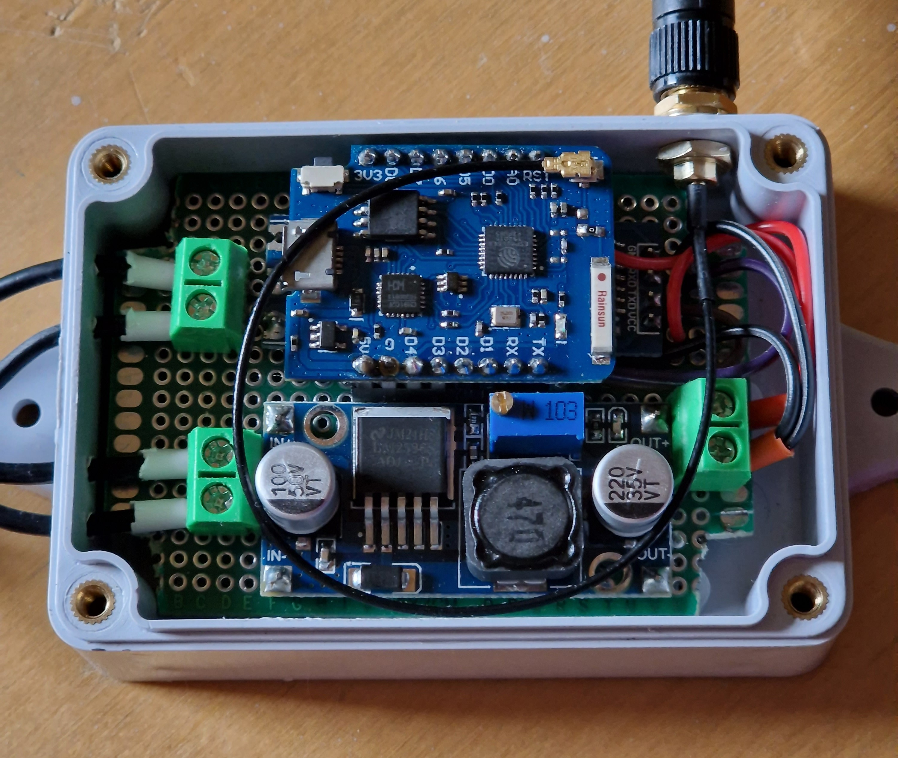
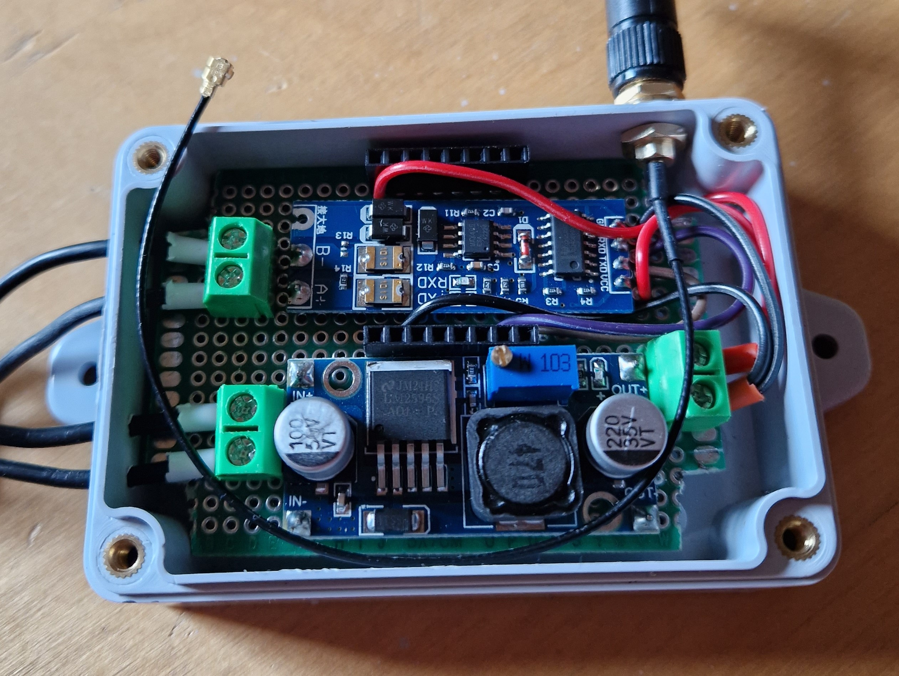

Good recourses which this is made with/froked from:

[Balboa worldwide app wiki](https://github.com/ccutrer/balboa_worldwide_app/wiki) ; [BWA Wiki Protocol page](https://github.com/ccutrer/balboa_worldwide_app/blob/main/doc/protocol.md) ; [jshank's bwalink](https://github.com/jshank/bwalink?tab=readme-ov-file#serial-to-ip-device) ; [Cribskip's esp8266_spa](https://github.com/cribskip/esp8266_spa) ; [jrowny's ESPHomeSpa (°F)](https://github.com/jrowny/ESPHomeSpa) ; [vBrolin's ESPHomeSpa (°C)](https://github.com/vBrolin/ESPHomeSpa)

# ESPHome Balboa Spa

Get local control of a Balboa spa using an ESPhome supported micro controller (ESP32, ESP8266)

# Funtionality

With this project you can:

- View and Control:
  - Temperature
  - Jets
  - Lights
  - Time on the spa clock
  - Onboard filtration cycles
- View the state of the spa heater and circulation pump
- Set temperature range (High/Low) and rest mode (Ready/Rest)

Upstream sources have been tested with Balboa BP2100G0 and BP601 series controllers
This fork has been tested with a BP2100G1 controller with an ESP8266

# Hardware and Connections

From upstream sources:

- [Parts](https://github.com/cribskip/esp8266_spa#parts)
- [Connections](https://github.com/cribskip/esp8266_spa#hardware-connections)

Some parts I used:

- Wemos D1 Mini Pro with an [external antenna*](pictures/external_antenna.md)
- [LM2596 Step-down voltage regulator (Aliexpress)](https://www.aliexpress.com/item/32653212622.html)
- TTL to RS458 module
- [Case**](https://www.aliexpress.com/item/1005005341333614.html) and [PCB 5X7](https://www.aliexpress.com/item/1005003384353640.html) (5X7 won't fit fully corners will have to be cut), both Aliexpress
- [Screw terminal blocks (Aliexpress)](https://www.aliexpress.com/item/32868515933.html)

**The case I used is kinda small, you can use a different bigger case

The hardware layout I used:

 

# Project defaults

This project is set up for:
- A Spa that has:
  - 3 Jets, 1 Light, Temperature in Celcius, 1 Heater, 1 Circulation pump, 2 Timeable filter cycles, Ready/Rest mode, High/Low temperature range and a clock for time
- An ESP8266

If your spa has more or less or different things you will most likely changed things in the code

# What is provided?

In this repo there is the .yaml configuration for esphome and the companion c++ file that makes the magic actually happen.

There are also dashboard card examples, srcipts and automations that will make setting up your spa controls in home assistant more pleasent. For most of these provided examples to work you will have to create some input helpers. 
More specifically 13 number helpers for all the different values.
All starting with input_number.spa_, so e.g 'input_number.spa_temp_high'

- temp_high;   range 26.5 to 40 with 0.5 step size
- clock_hour, f1_dur_hour, f1_hour, f2_dur_hour, f2_hour;   range 0 to 23 with 1 step size
- clock_minute, f1_dur_min, f1_min, f2_dur_min, f2_min;   range 0 to 59 with 1 step size

# To Do

- Fix any issues that pop up and improve the project
- Possibly implement the ablity to properly set target temperature in low heat mode which is 10.0 to 37.0
- Fault codes into HA, not just esphome logger, very low priority
- Temperature switch for F, very very low priority :P
